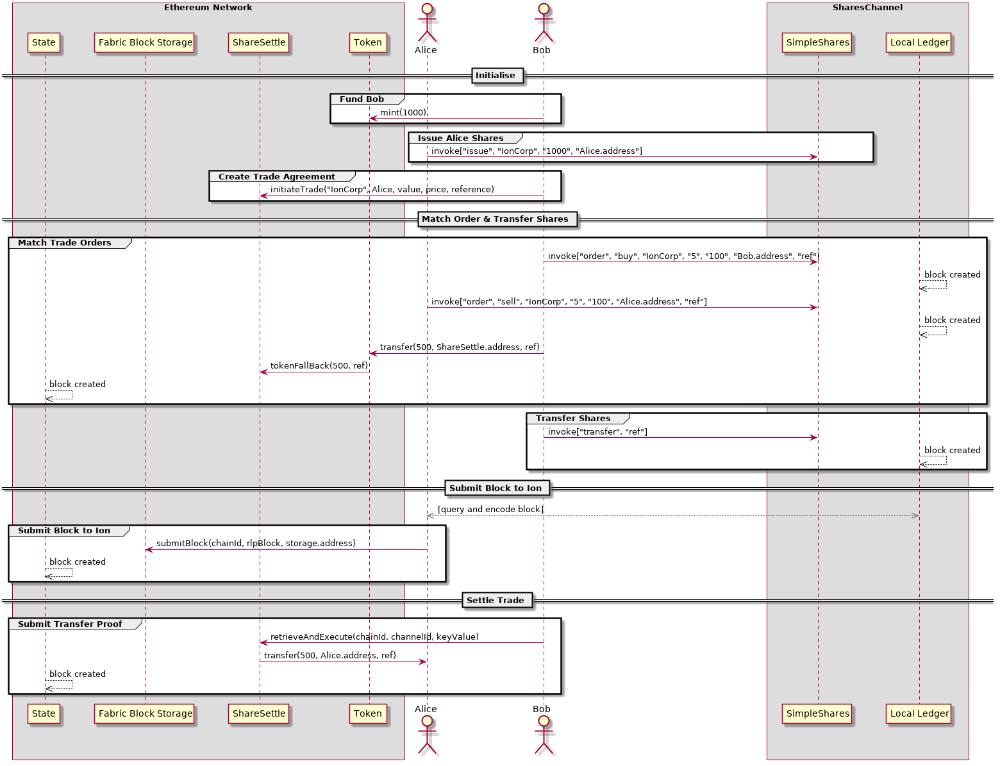

# SimpleShares
SimpleShares is the name of a cross chain [Delivery versus Payment](https://www.investopedia.com/terms/d/dvp.asp) model for the HackIon hackathon. The model allows users to issue and trade shares on a Hyperledger Fabric network and perform the settlement on an Ethereum network, using the [Ion Interoperability Framework](https://github.com/clearmatics/ion).

Users should be able to follow the guide to settle the trade of an equity, serving as an example of how to build cross-chain and platform interacting chaincode and smart contracts.

## SimpleShares Platform
The `SimpleShares` platform is an example of Fabric-Ethereum interoperability through the Ion framework. Using the platform shares of companies can be issued and traded, with a simple matching service for users to broadcast buy and sell orders to the platform.

Then, once users have executed trades and transfered the ownership title, blocks containing such transactions are passed to a smart contract `ShareSettle` deployed on an Ethereum network. The `ShareSettle` contract has a copy of the initial trade agreement against which it verifies that the title transfer executed correctly. If the shares were transferred as expected `ShareSettle` triggers a payment to settle the trade.

In this example two organisations, Alice and Bob, wish to perform a DvP trade where Alice sells Bob 5 shares of `IonCorp` priced at 100 token each.

**Note:** Names Bob and Alice are chosen merely to give use-case context, no other affiliation is implied.

### Flow Overview


## Getting Started
The following tutorial guides users how to run the `SimpleShares` example, which models the settlement of a share title transfer between an Ethereum and Fabric network.

### Requirements
Prior to running the example the following requirements must be installed:
* [Docker](https://www.docker.com/get-started)
* [Docker Compose](https://docs.docker.com/compose/)
* [Ion](https://github.com/ion)
* [Fabric-CLI](https://github.com/Shirikatsu/fabric-examples)
* Node v9.5+


### Network Setup
Users should be able to run the entire example locally. To do so the following components must be run:
* Etherum Network and Smart Contracts
* Ion Command Line Interface
* Hyperledger Fabric Network and Chaincode
* Hyperledger Fabric Command Line Interface

To simplify the build process the Ethereum network and Ion CLI are part of a single docker container, and similarly the Fabric network and CLI another.

#### a. Launch Ethereum Network and Ion CLI
First clone and enter the `SimpleShares` directory.
```
git clone https://github.com/clearmatics/simpleshares
cd ${GOPATH}/src/github.com/clearmatics/simpleshares
```

Then build and launch the simpleshares docker containers:
```
docker build -t simpleshares/dev .
docker run -ti --name eth-network simpleshares/dev
```

In the eth-network container launch the Ethereum network.
```
make ethereum-network
```

In a fresh terminal users should reattach to the docker image and deploy the smart contracts required to the Ethereum network,
```
docker exec -ti eth-network /bin/bash
npm run deploy > output.txt
```

saving the output to a text file `output.txt` as the deployed contract addresses will be needed later in the guide. If deployment is successful the `output.txt` should contain the addresses as below. 

**Note:** the contract addresses may not be the same.

```
...
...
...

Running migration: 1_init0x792bff8ec8bbd22be54b556b23910d13fff283aas
  Deploying Migrations...0x792bff8ec8bbd22be54b556b23910d13fff283aa
  ... 0xb3d0085cfb6a47eaebd00c8c5cc68ecc2782defbc9a3c82410a54b22c7910c3c
  Migrations: 0x325e08c6ca2b28253ae2280403ba9095895109f3
Saving successful migration to network...
  ... 0x850ac0a258d39208ac471b40e687786501cede1e3724ec793a67e0502fc9f218
Saving artifacts...
Running migration: 2_deploy_contracts.js
  Deploying Ion...
  ... 0x643d92067253ecb08192e6aa7d5ae7c3fcf939dbdab349d5125942674ede5b46
  Ion: 0xdc2e166cf663398f0df6dd3b7b321bbf16bc7fa6
  Deploying Base...
  ... 0x34e56034a909865284306f9d933eb59658cec6a7662cb33e6e88d184aa6dfdbe
  Base: 0x792bff8ec8bbd22be54b556b23910d13fff283aa
  Deploying FabricStore...
  ... 0x75d6be8e184b42b321c4f5487fb1fadc189f5f0b5e63b91469f0f0f32714a930
  FabricStore: 0x563114ea622ee089ed440a94322f2bb52dfc6cef
  Deploying Token...
  ... 0x8d84f2418464da4ae6bed6f3d01347b8d32a51954acb4e985bcc7e9b6eacb885
  Token: 0x6a26fa8abc63852faf9b39d41874314f574145dc
  Deploying ShareSettle...
  ... 0xcbc5982fbc91063a04561fa3ff6f28a33cf56c613832ba275942b6488ce11bee
  ShareSettle: 0xcfca9e1f667c106bbe7e78cdcf11cc08808f00c7
Saving successful migration to network...
  ... 0xdf6f9fa7bcf33968af2f2f90cccbb7fb6e2606178c7748a52b6fa97889bcf36c
Saving artifacts...

```

Users interact with each client through a command line interface - CLI. The [Ion CLI](https://github.com/clearmatics/ion/tree/master/ion-cli), will be used to interact with the Ethereum network. Similarly for the Fabric users will use the [Fabric CLI](https://github.com/Shirikatsu/fabric-examples).

The Ion CLI has been downloaded as part of the eth-network docker container. However it is still required to build it, enter the Ion CLI directory from the eth-network container and run the build command,
```
cd /go/src/github.com/clearmatics/ion/ion-cli
make build
```

upon successful build users should launch the CLI:
```
./ion-cli
===============================================================
Ion Command Line Interface

Use 'help' to list commands
===============================================================
>>>
```

The Ion CLI has the ability to connect directly to the Ethereum network running locally. Users who are connecting to the Ethereum network launched as in the previous step can connect through the endpoint `127.0.0.1:8545`, running command:
```
>>> connectToClient http://127.0.0.1:8545
Connecting to client...

Connected!
===============================================================
```

Upon successful connection users need to add an account that will sign transactions. The Ion CLI allows multiple accounts to be registered with the tool, this allows submission of transactions from different addresses. Bob and Alice have a specific public-private key pair which we can supply to the Ion CLI to make transactions on their behalf. 

**Note:** Both keys are encrypted with the passphrase - `password`.

To use the accounts unlocked in the `testrpc` user run the following,
```
>>> addAccount Bob /go/src/github.com/clearmatics/simpleshares/docs/keystore/UTC--2018-10-29T10-37-04.152895326Z--280d9c579809eda6c0be390fb3c0943689be2d9b
Please provide your key decryption password.

Account added succesfully.
===============================================================
>>> addAccount Alice /go/src/github.com/clearmatics/simpleshares/docs/keystore/UTC--2018-11-08T11-11-16.216523936Z--dbad2ab2ff31d2823089447298e1df08dec457bd
Please provide your key decryption password.

Account added succesfully.
===============================================================
```

**Note:** throughout the example Alice and Bob will use the addresses `0xdbad2ab2ff31d2823089447298e1df08dec457bd` and `0x280d9c579809eda6c0be390fb3c0943689be2d9b` respectively.

Next we create instances of the each contract that we will need to use through the Ion CLI.
```
>>> addContractInstance validation /go/src/github.com/clearmatics/simpleshares/contracts/validation/BaseValidation.sol
Compiling contract...
Creating contract instance...
Added!
===============================================================
>>> addContractInstance token /go/src/github.com/clearmatics/simpleshares/contracts/functional/Token.sol
Compiling contract...
Creating contract instance...
Added!
===============================================================
>>> addContractInstance shareSettle /go/src/github.com/clearmatics/simpleshares/contracts/functional/ShareSettle.sol
Compiling contract...
Creating contract instance...
Added!
===============================================================
```

Following instantiation of the contracts register the validation contract and then create the cross-chain link with the Fabric network. The validation contract address can be found in `outputs.txt`:
```
>>> transactionMessage validation register Bob <validation-address> 0 10000000
Marshalling ABI
JSONify ABI
Packing Args to ABI
Retrieving public key
Creating transaction
Signing transaction
SENDING TRANSACTION
Waiting for transaction to be mined...
Transaction hash: 0x0581bbb17c86b5de974abb03d7446a4d5c158014e1ffbb8ca27d491aeda8cab6
===============================================================
>>> transactionMessage validation RegisterChain Bob <validation-address> 0 10000000
Enter input data for parameter _chainId:
0x22b55e8a4f7c03e1689da845dd463b09299cb3a574e64c68eafc4e99077a7254
Argument is array

Enter input data for parameter _storeAddr:
<storage-address>
Argument is array

Marshalling ABI
JSONify ABI
Packing Args to ABI
Retrieving public key
Creating transaction
Signing transaction
SENDING TRANSACTION
Waiting for transaction to be mined...
Transaction hash: 0xb3190ab392887e3b60f757f498c854715969a9d38b6ad88900f5dd7eeb959824
===============================================================
```

#### b. Deploy SimpleShares Chaincode
Next users instantiate the Hyperledger Fabric network with the relevant chaincode. 
```
make fabric-network
```

Next we move to the Fabric network to install and instantiate the `SimpleShares` chaincode. To do this we open a new terminal and enter the [Fabric-CLI](https://github.com/Shirikatsu/fabric-examples), if this is not installed please do so.
```
go get github.com/Shirikatsu/fabric-examples
cd ${GOPATH}/src/github.com/Shirikatsu/fabric-examples/fabric-cli/cmd/fabric-cli
```

Once the Fabric-CLI is installed users can use it to send transactions into the Fabric network. First users create the channel and the anchor peers.
```
go run fabric-cli.go channel create --cid sharechannel --txfile ${GOPATH}/src/github.com/clearmatics/simpleshares/network/fixtures/fabric/v1.3/channel/sharechannel.tx --config ${GOPATH}/src/github.com/clearmatics/simpleshares/config_shareplatform.yaml
Attempting to create/update channel: sharechannel
Channel created/updated: sharechannel

go run fabric-cli.go channel create --cid sharechannel --txfile ${GOPATH}/src/github.com/clearmatics/simpleshares/network/fixtures/fabric/v1.3/channel/sharechannelAliceMSPanchors.tx --config ${GOPATH}/src/github.com/clearmatics/simpleshares/config_shareplatform.yaml --orgid alice
Attempting to create/update channel: sharechannel
Channel created/updated: sharechannel

go run fabric-cli.go channel create --cid sharechannel --txfile ${GOPATH}/src/github.com/clearmatics/simpleshares/network/fixtures/fabric/v1.3/channel/sharechannelBobMSPanchors.tx --config ${GOPATH}/src/github.com/clearmatics/simpleshares/config_shareplatform.yaml --orgid bob
Attempting to create/update channel: sharechannel
Channel created/updated: sharechannel
```

Following this join the channel
```
go run fabric-cli.go channel join --cid sharechannel --config ${GOPATH}/src/github.com/clearmatics/simpleshares/config_shareplatform.yaml
Attempting to join channel: sharechannel
Joining channel sharechannel on org[alice] peers:
-- localhost:7051
-- localhost:7151
==========> JOIN ORG: alice
Channel sharechannel joined!
Joining channel sharechannel on org[bob] peers:
-- localhost:8051
-- localhost:9051
==========> JOIN ORG: bob
Channel sharechannel joined!
```

Then the `SimpleShares` chaincode must be installed and instantiated with a chaincode endorsement policy. In the example below chaincode policy requires that both Bob and Alice must endorse all transactions for them to be appended to the ledger.
```
go run fabric-cli.go chaincode install --ccp=github.com/clearmatics/SimpleShares --ccid=Shares --v v0 --gopath ${GOPATH}/src/github.com/clearmatics/simpleshares/chaincode --config ${GOPATH}/src/github.com/clearmatics/simpleshares/config_shareplatform.yaml
Installing chaincode Shares on org[bob] peers:
-- localhost:8051
-- localhost:9051
...successfuly installed chaincode Shares.v0 on peer localhost:8051.
...successfuly installed chaincode Shares.v0 on peer localhost:9051.
Installing chaincode Shares on org[alice] peers:
-- localhost:7051
-- localhost:7151
...successfuly installed chaincode Shares.v0 on peer localhost:7151.
...successfuly installed chaincode Shares.v0 on peer localhost:7051.

go run fabric-cli.go chaincode instantiate --cid sharechannel --ccp=github.com/clearmatics/SimpleShares --ccid Shares --v v0 --policy "AND('AliceMSP.member','BobMSP.member')" --config ${GOPATH}/src/github.com/clearmatics/simpleshares/config_shareplatform.yaml
...successfuly instantiated chaincode Shares on channel sharechannel
```

### Executing the Cross Chain DvP
Having deployed both networks and the requisite contracts and chaincodes we are ready to run the `SimpleShares` DvP model, as shown in the flow overview.

#### 1. Issue Token and Equities
In order to settle the trade as per the trade agreement the recipient needs to have enough funds. Therefore users mint 1000 tokens and transfer them to Bob using the Ion CLI.
```
>>> transactionMessage token mint Bob <token-address> 0 100000
Enter input data for parameter _value:
1000
Marshalling ABI
JSONify ABI
Packing Args to ABI
Retrieving public key
Creating transaction
Signing transaction
SENDING TRANSACTION
Waiting for transaction to be mined...
Transaction hash: 0xb31c943427b755ef2f984428aad4745f79c9b3b6dff649d0d115afc07c419440
===============================================================
```

We can verify this occured by making a call to the contract:
```
>>> callMessage token balanceOf Bob <token-address>
Enter input data for parameter _owner:
0x280d9c579809eda6c0be390fb3c0943689be2d9b
Argument is array

Result: 1000
===============================================================
```

Similarly on the Fabric network Alice need to have enough equities to fulfil their leg of the trade. To issue Alice 1000 shares of IonCorp execute command,
```
go run fabric-cli.go chaincode invoke --cid sharechannel --ccid Shares --args '{"Func":"issue","Args":["IonCorp", "1000", "0xdbad2ab2ff31d2823089447298e1df08dec457bd"]}' --peer localhost:7051,localhost:8051 --payload --config ${GOPATH}/src/github.com/clearmatics/simpleshares/config_shareplatform.yaml
```

we can the then verify this has occured by querying the shares ledger:
```
go run fabric-cli.go chaincode query --cid sharechannel --ccid Shares --args '{"Func":"query","Args":["shares"]}' --peer localhost:7051,localhost:8051 --payload --config ${GOPATH}/src/github.com/clearmatics/simpleshares/config_shareplatform.yaml
****************************************************************************************************
Payload: {
 "organisation": [
  {
   "name": "IonCorp",
   "totalsupply": 1000,
   "shareholders": [
    {
     "shareholder": "0xdbad2ab2ff31d2823089447298e1df08dec457bd",
     "amount": 1000
    }
   ]
  }
 ]
}
```

A JSON is returned where we see IonCorp has one shareholder which is the public key associated with Alice.

#### 2. Create Trade Agreement
The model DvP trade requires that a trade agreement is created on each chain, users instantiate a trade agreement on the Ethereum chain against which the Fabric equity transfer will be verified against at settlement.
```
>>> transactionMessage shareSettle initiateTrade Bob <shareSettle-address> 0 1000000
Enter input data for parameter _org:
IonCorp
Enter input data for parameter _recv:
0xdbad2ab2ff31d2823089447298e1df08dec457bd
Argument is array

Enter input data for parameter _amount:
5
Enter input data for parameter _price:
100
Enter input data for parameter _ref:
0x4e52d155da5201665edb2f3b9bdce035c4afdf0f5c1f764c9507c690e57ec6ef
Argument is array

Marshalling ABI
JSONify ABI
Packing Args to ABI
Retrieving public key
Creating transaction
Signing transaction
SENDING TRANSACTION
Waiting for transaction to be mined...
Transaction hash: 0x4a699208a81cd6c339287799361bc75513544700368c66e08138f2d31e8516e2
===============================================================
```

#### 3. Place Sell Order 
The Fabric network is not only a ledger of shares held by individual parties, rather it serves also as a matching engine for buyers and sellers. First a sell order is placed into the engine on behalf of Alice,
```
go run fabric-cli.go chaincode invoke --cid sharechannel --ccid Shares --args '{"Func":"order","Args":["IonCorp", "Sell", "5", "100", "0xdbad2ab2ff31d2823089447298e1df08dec457bd", "uniqueRef"]}' --peer localhost:7051,localhost:8051 --payload --config ${GOPATH}/src/github.com/clearmatics/simpleshares/config_shareplatform.yaml
```

#### 4. Match Sell Order 
The matching engine allows counterparties to view the offers and bid accordingly. Next users place a buy order to fill the that of Alice.
```
go run fabric-cli.go chaincode invoke --cid sharechannel --ccid Shares --args '{"Func":"order","Args":["IonCorp", "Buy", "5", "100", "0x280d9c579809eda6c0be390fb3c0943689be2d9b", "uniqueRef"]}' --peer localhost:7051,localhost:8051 --payload --config ${GOPATH}/src/github.com/clearmatics/simpleshares/config_shareplatform.yaml
```


#### 5. Escrow Token Funds
In the previous step users matched the orders of Alice and Bob, now Bob must escrow their funds on the Ethereum network as to allow settlement when the proof of title transfer is passed to the `ShareSettle` contract.
```
>>> transactionMessage token metadataTransfer Bob <token-address> 0 100000
Enter input data for parameter _to:
<shareSettle-address>
Argument is array

Enter input data for parameter _value:
500
Enter input data for parameter _ref:
0x4e52d155da5201665edb2f3b9bdce035c4afdf0f5c1f764c9507c690e57ec6ef
Argument is array

Marshalling ABI
JSONify ABI
Packing Args to ABI
Retrieving public key
Creating transaction
Signing transaction
SENDING TRANSACTION
Waiting for transaction to be mined...
Transaction hash: 0xd4e90d081661f0f018763fb2803d69062575bb997f866390bfc4fb1f017cc4d6
===============================================================
```

Next verify the transfer took place by querying the `ShareSettle` contract's token balance:
```
>>> callMessage token balanceOf Bob <token-address>
Enter input data for parameter _owner:
<shareSettle-address>
Argument is array

Result: 500
===============================================================
```

#### 6. Invoke Transfer of Share Title
As Bob has escrowed their funds Alice should now transfer the share titles as defined in the order. To do so they invoke the `transfer` function of the `SimpleShares` chaincode passing the reference to the order.
```
go run fabric-cli.go chaincode invoke --cid sharechannel --ccid Shares --args '{"Func":"transfer","Args":["uniqueRef"]}' --peer localhost:7051,localhost:8051 --payload --config ${GOPATH}/src/github.com/clearmatics/simpleshares/config_shareplatform.yaml
```

Querying the shares ledger shows the transfer to have completed:
```
go run fabric-cli.go chaincode query --cid sharechannel --ccid Shares --args '{"Func":"query","Args":["shares"]}' --peer localhost:7051,localhost:8051 --payload --config ${GOPATH}/src/github.com/clearmatics/simpleshares/config_shareplatform.yaml
****************************************************************************************************
Payload: {
 "organisation": [
  {
   "name": "IonCorp",
   "totalsupply": 1000,
   "shareholders": [
    {
     "shareholder": "0xdbad2ab2ff31d2823089447298e1df08dec457bd",
     "amount": 500
    },
    {
     "shareholder": "0x280d9c579809eda6c0be390fb3c0943689be2d9b",
     "amount": 500
    }
   ]
  }
 ]
}
```

#### 7. Query and Encode Fabric Block
To settle the trade the block containing the transafer transaction is passed to the validation contract in the Ethereum network. However the block must be in a format consumable by the validation and storage contracts, thus the Fabric CLI allows users to return RLP encoded blocks.

Running,
```
go run fabric-cli.go query block_formatted --cid sharechannel --num 7 --base64 --config ${GOPATH}/src/github.com/clearmatics/simpleshares/config_shareplatform.yaml

0xf901e2f901df8c73686172656368616e6e656cf901cfab557146756175414f38364c6c2d72664671626c6352654e393358536b4c5474534835485a7270636f57556b07ab30595754694766594d7a766133794a47796642624b70364d6e7150582d704331385f416e6a2d4e6a394b63ab74464f56494e444e4b71696f35423455536e524d78736775704b62496a704472545a4e7139755158396d49845c5436d784112e314ff9013df9013ab84066346635313632613763353834363837326465666264323231653765323730343761366534343066656662643436396332316663643838326532663265363163f8f6f8e186536861726573e1ca866f7264657273c20680ca86736861726573c20480ca86747261646573c20380f8b6f853867368617265738566616c7365b844f842f840f83e87496f6e436f72708203e8f2d894dbad2ab2ff31d2823089447298e1df08dec457bd8201f4d894280d9c579809eda6c0be390fb3c0943689be2d9b8201f4f85f867472616465738566616c7365b850f84ef84cf84a89756e69717565526566f83e87496f6e436f727094dbad2ab2ff31d2823089447298e1df08dec457bd94280d9c579809eda6c0be390fb3c0943689be2d9b056489756e69717565526566d2846c736363cbca86536861726573c20380c0
```

output of which will be needed in the next step.

**Note:** is users have submitted additional transactions to the Fabric network the transaction may not be contained in block 7.

#### 8. Submit Fabric Block to Storage Contract
Having successfully RLP encoded the block containing thge transfer transaction users submit this block to the validation contract, noticing that the output of step 7 is the input for argument `_rlpBlock`:
```
>>> transactionMessage validation SubmitBlock Bob <validation-address> 0 10000000
Enter input data for parameter _chainId:
0x22b55e8a4f7c03e1689da845dd463b09299cb3a574e64c68eafc4e99077a7254
Argument is array

Enter input data for parameter _rlpBlock:
0xf901e2f901df8c73686172656368616e6e656cf901cfab557146756175414f38364c6c2d72664671626c6352654e393358536b4c5474534835485a7270636f57556b07ab30595754694766594d7a766133794a47796642624b70364d6e7150582d704331385f416e6a2d4e6a394b63ab74464f56494e444e4b71696f35423455536e524d78736775704b62496a704472545a4e7139755158396d49845c5436d784112e314ff9013df9013ab84066346635313632613763353834363837326465666264323231653765323730343761366534343066656662643436396332316663643838326532663265363163f8f6f8e186536861726573e1ca866f7264657273c20680ca86736861726573c20480ca86747261646573c20380f8b6f853867368617265738566616c7365b844f842f840f83e87496f6e436f72708203e8f2d894dbad2ab2ff31d2823089447298e1df08dec457bd8201f4d894280d9c579809eda6c0be390fb3c0943689be2d9b8201f4f85f867472616465738566616c7365b850f84ef84cf84a89756e69717565526566f83e87496f6e436f727094dbad2ab2ff31d2823089447298e1df08dec457bd94280d9c579809eda6c0be390fb3c0943689be2d9b056489756e69717565526566d2846c736363cbca86536861726573c20380c0
Argument is array

Enter input data for parameter _storageAddr:
<storage-address>
Argument is array

Marshalling ABI
JSONify ABI
Packing Args to ABI
Retrieving public key
Creating transaction
Signing transaction
SENDING TRANSACTION
Waiting for transaction to be mined...
Transaction hash: 0xabd8e1a629dec8acd6251401f1ecf3aa04e0b1db7db68c0012da8256eb8af714
===============================================================
```

#### 9. Settle Trade
Once the block containing the equities transfer is submitted to the Ehtereum network the trade can be settled. `ShareSettle` has the ability to query the blocks persisted in the Fabric storage contract and verify whether transactions executed as expected. Thus users verify that the equities transfered for the trade, identified via its unique reference, executed as expected,
```
>>> transactionMessage shareSettle retrieveAndExecute Bob <shareSettle-address> 0 10000000000
Enter input data for parameter _chainId:
0x22b55e8a4f7c03e1689da845dd463b09299cb3a574e64c68eafc4e99077a7254
Argument is array

Enter input data for parameter _channelId:
sharechannel
Enter input data for parameter _key:
trades

Marshalling ABI
JSONify ABI
Packing Args to ABI
Retrieving public key
Creating transaction
Signing transaction
SENDING TRANSACTION
Waiting for transaction to be mined...
Transaction hash: 0x96fkebab36f72708203e8f2d894dbad2ab2ff31d2823089447eb8af71412ds28
===============================================================
```

To verify that the trade is settled users can check that `ShareSettle` has disbursed the escrowed funds by checking the token balance of the relevat accounts.

First checking the balance of Alice,
```
>>> callMessage token balanceOf Bob <token-address>
Enter input data for parameter _owner:
0xdbad2ab2ff31d2823089447298e1df08dec457bd
Argument is array

Result: 500
===============================================================
```

which returns 500 as exected, and then the balance of the `ShareSettle` contract,


```
>>> callMessage token balanceOf Bob <token-address>
Enter input data for parameter _owner:
<sharesettle-address>
Argument is array

Result: 0
===============================================================
>>> 
```

as funds have moved from Bob to the escrow contract and finally to Alice the trade is settled!

### SimpleShares
Details here are the commands available in the simpleshare contract:
```
Function:       order
Description:    allows a user to place an order to buy/sell N shares of a specific organisation, matching occurs automatically
Arguments:      
    * [organisation] - name of the equities
    * [buy/sell] - indicates whether it is a buy or sell order
    * [amount] -  number of shares being offered
    * [price] - price to pay per share
    * [account] - identity of the buyer/seller
    * [reference] - unique reference to identify the trade
```

```
Function:       issue
Description:    allows issuance of N shares of company X
Arguments:
    * [organisation] - name of equities
    * [amount] - number of shares issued
    * [shareholder] - initial shareholder to whom shares are issued
```
```
Function:       transfer
Description:    allows transfer of N shares from sender to receiver, as defined by trade agreement
Arguments:
    * [reference] - reference to matched which
```
```
Function:       query
Description:    lets users query the database for both the order book and equity balances
Arguments:
    * [shares/order/trades] - returns either the share balances, order book or executed trade listings
```

